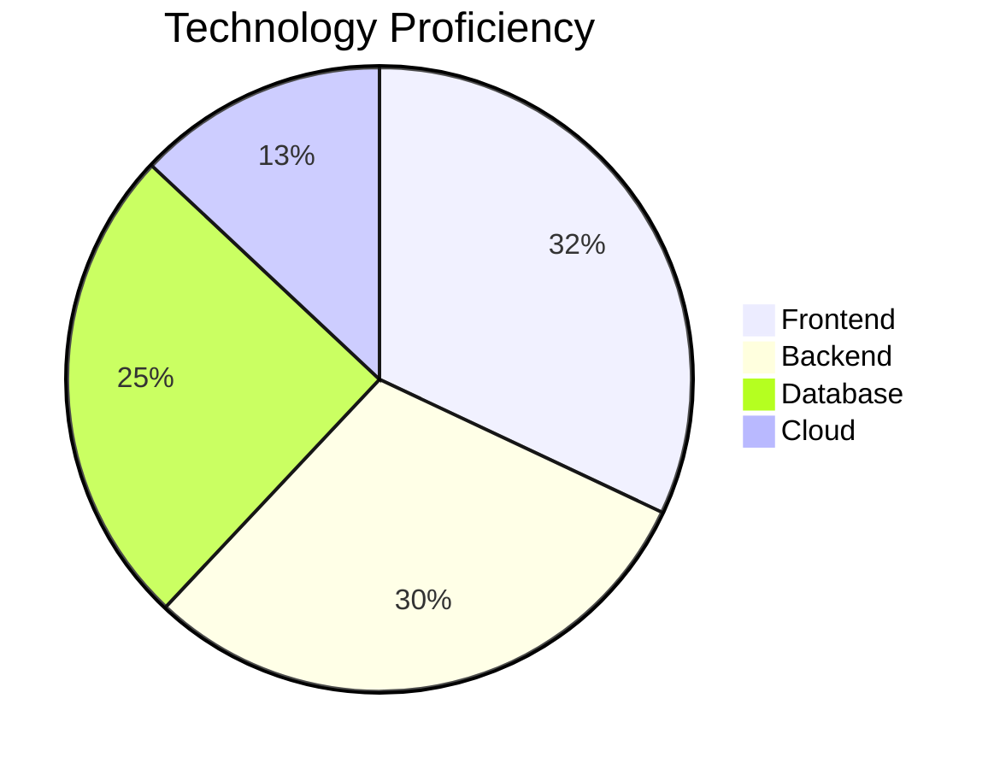

# FAYIS NAMBIYATH 
> **Full-Stack Developer** | Building meaningful digital experiences

<div align="center">
  
  
  
  [](https://visitcount.itsvg.in)
  [](https://linkedin.com/in/fayis-nambiyath)

</div>

## ⚡ Performance Metrics

<table>
  <tr>
    <td width="50%">
      
    </td>
    <td width="50%">
      
    </td>
  </tr>
</table>

## 💻 Technology Radar

<!-- Custom tech radar chart inspired by thoughtworks tech radar -->


## 🧰 Tech Arsenal

<div align="center">

### Frontend


### Backend


### Database


### Cloud


</div>

## 📊 Code Distribution

<div align="center">
  
</div>

## 📈 Weekly Development Breakdown

```text
JavaScript   █████████████▒░░   65.7%
HTML/CSS     ███████░░░░░░░░░   35.2%
Node.js      ████████░░░░░░░░   40.3%
Express      ██████░░░░░░░░░░   30.1%
MySQL        █████░░░░░░░░░░░   25.4%
MongoDB      ████░░░░░░░░░░░░   20.7%
```

---

<div align="center">
  <b>Let's build something amazing together!</b>
</div>
